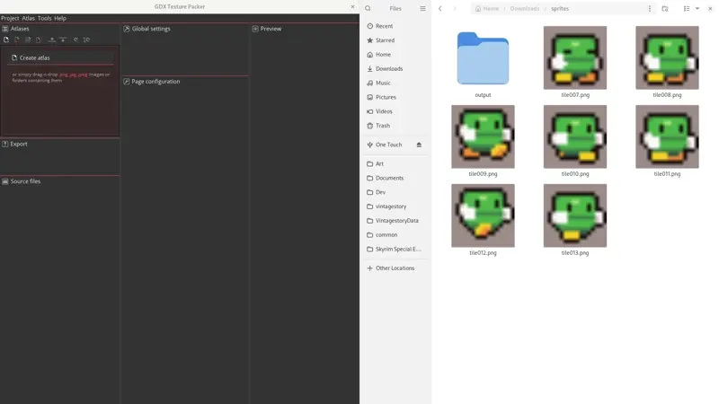

# bevy_libgdx_atlas

[](https://bevyengine.org/learn/quick-start/plugin-development/#main-branch-tracking)
[](https://crates.io/crates/bevy_libgdx_atlas)
[](https://docs.rs/bevy_libgdx_atlas)


Support loading `libgdx.atlas` files (used for sprite sheets and such) as Bevy assets.

## Usage

Pack your spritesheet using https://github.com/crashinvaders/gdx-texture-packer-gui



Add the `LibGdxAssetPlugin` to your app:

```rust
use bevy::prelude::*;
use bevy_libgdx_atlas::*;

let app = App::new();
app.add_plugins(MinimalPlugins);
app.add_plugins(AssetPlugin::default());
app.add_plugins(LibGdxAssetPlugin);
```

Now when you load files with the `.libgdx.atlas` extension through the asset server, or even `bevy_asset_loader`, they will load as a `LibGdxAtlasAsset` which you can then use.


## Contributing

[See our CONTRIBUTING.md](/CONTRIBUTING.md)

## Our Other Crates

- [bevy_device_lang](https://github.com/rustunit/bevy_device_lang)
- [bevy_ios_review](https://github.com/rustunit/bevy_ios_review)
- [bevy_ios_impact](https://github.com/rustunit/bevy_ios_impact)
- [bevy_ios_alerts](https://github.com/rustunit/bevy_ios_alerts)
- [bevy_ios_iap](https://github.com/rustunit/bevy_ios_iap)
- [bevy_ios_notifications](https://github.com/rustunit/bevy_ios_notifications)
- [bevy_ios_gamecenter](https://github.com/rustunit/bevy_ios_gamecenter)
- [bevy_web_popups](https://github.com/rustunit/bevy_web_popups)

## Compatible Bevy Versions

|bevy|bevy_libgdx_atlas|
|-|-|
|0.14|0.2|
|0.13|0.1|

## License

bevy_libgdx_atlas is dual-licensed under either [MIT](https://opensource.org/license/MIT) or [Apache 2.0](https://www.apache.org/licenses/LICENSE-2.0), at your option.
