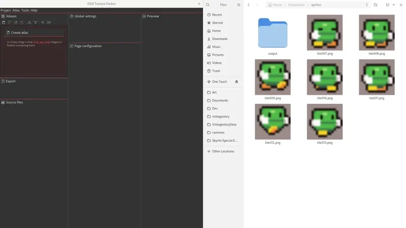
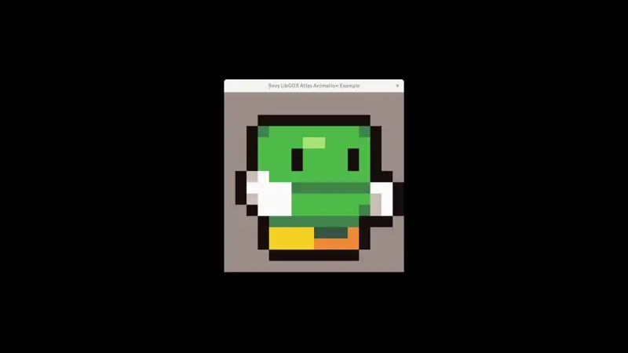

# bevy_libgdx_atlas

[](https://bevyengine.org/learn/quick-start/plugin-development/#main-branch-tracking)
[](https://crates.io/crates/bevy_libgdx_atlas)
[](https://docs.rs/bevy_libgdx_atlas)
[![discord][sh_discord]][lk_discord]

[sh_discord]: https://img.shields.io/discord/1176858176897953872?label=discord&color=5561E6
[lk_discord]: https://discord.gg/rQNeEnMhus

Support loading `libgdx.atlas` files (used for sprite sheets and such) as Bevy assets.

Read the article with more context around sprite atlases in Bevy on the [rustunit blog](https://rustunit.com/blog/2024/10-21-bevy-libgdx-atlas/).

## Usage

Pack your spritesheet using https://github.com/crashinvaders/gdx-texture-packer-gui

Both the current and the pre-1.9.11 atlas format are supported. Rotation must be off and
the atlas must fit a single page, since a Bevy `TextureAtlasLayout` cannot express either.



Add the `LibGdxAssetPlugin` to your app:

```rust
use bevy::prelude::*;
use bevy_libgdx_atlas::*;

let app = App::new();
app.add_plugins(MinimalPlugins);
app.add_plugins(AssetPlugin::default());
app.add_plugins(LibGdxAssetPlugin);
```

Now when you load files with the `.libgdx.atlas` extension through the asset server, or even `bevy_asset_loader`, they will load as a `LibGdxAtlasAsset` which you can then use.

Regions are addressed by the name they carry in the atlas file:

```rust
// ready-to-spawn Sprite
commands.spawn(atlas.sprite("tile007").unwrap());

// or just the pieces
let index: Option<usize> = atlas.index("tile007");
let texture_atlas: Option<TextureAtlas> = atlas.texture_atlas("tile007");

// frames of an animation, in name order ("hero_2" before "hero_10")
let frames: Vec<usize> = atlas.frames("hero_");

// UI
commands.spawn(atlas.image_node("tile007").unwrap());

// retarget an existing Sprite or ImageNode
if !atlas.apply(&mut sprite.texture_atlas, "tile008") {
    warn!("no such region");
}
```

> [!WARNING]
> The raw indices in `LibGdxAtlasAsset::regions` follow the order the packer wrote the
> regions in, which is neither name order nor stable across repacks. Use `frames()`
> to drive an animation.

`sprite()` and `image_node()` sit behind the default-on `sprite` and `ui` features, which
pull in `bevy_sprite` and `bevy_ui`. Turn either off with `default-features = false`;
`index()`, `texture_atlas()`, `frames()` and `apply()` need neither.



> [!TIP]
> Run `cargo run --example animation` to see this example for yourself!

## Contributing

[See our CONTRIBUTING.md](/CONTRIBUTING.md)

## Our Other Crates

- [bevy_debug_log](https://github.com/rustunit/bevy_debug_log)
- [bevy_device_lang](https://github.com/rustunit/bevy_device_lang)
- [bevy_web_popups](https://github.com/rustunit/bevy_web_popups)
- [bevy_ios_iap](https://github.com/rustunit/bevy_ios_iap)
- [bevy_ios_review](https://github.com/rustunit/bevy_ios_review)
- [bevy_ios_gamecenter](https://github.com/rustunit/bevy_ios_gamecenter)
- [bevy_ios_alerts](https://github.com/rustunit/bevy_ios_alerts)
- [bevy_ios_notifications](https://github.com/rustunit/bevy_ios_notifications)
- [bevy_ios_impact](https://github.com/rustunit/bevy_ios_impact)
- [bevy_ios_safearea](https://github.com/rustunit/bevy_ios_safearea)

## Compatible Bevy Versions

|bevy|crate|
|-|-|
|0.19|0.7,main|
|0.18|0.6|
|0.17|0.5|
|0.16|0.4|
|0.15|0.3|
|0.14|0.2|
|0.13|0.1|

## License

bevy_libgdx_atlas is dual-licensed under either [MIT](https://opensource.org/license/MIT) or [Apache 2.0](https://www.apache.org/licenses/LICENSE-2.0), at your option.
